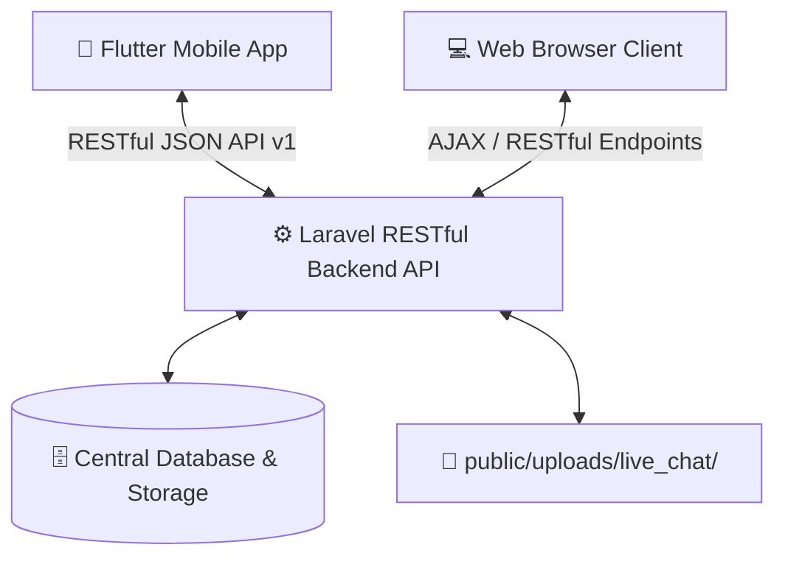

# 🚀 Everything Check and Full Documentation Problem Solve Restful API

Complete, production-ready RESTful API specifications and data synchronization architecture between **Web Platform** and **Mobile App (Flutter / Android / iOS)** for **M Bangla Patente B**.

---

## 📑 Table of Contents

1. [Architecture & Web-App Synchronization Overview](#-1-architecture--web-app-synchronization-overview)
2. [Base URLs & Standard Request Headers](#-2-base-urls--standard-request-headers)
3. [Client Verification & Support Registration API](#-3-client-verification--support-registration-api)
4. [Saved / Bookmarked MCQs API (Bidirectional Sync)](#-4-saved--bookmarked-mcqs-api-bidirectional-sync)
5. [Notes & Noted MCQs API (Bidirectional Sync)](#-5-notes--noted-mcqs-api-bidirectional-sync)
6. [Correct, Wrong & Test Results Logging API](#-6-correct-wrong--test-results-logging-api)
7. [Practice Tests, Scheda Esame & Exam Simulator API](#-7-practice-tests-scheda-esame--exam-simulator-api)
8. [Live Chat & Attachment/Image Upload API](#-8-live-chat--attachmentimage-upload-api)
9. [Dictionary, Vocabulary & Instant Translation API](#-9-dictionary-vocabulary--instant-translation-api)
10. [License Activation & QR Code Unlock API](#-10-license-activation--qr-code-unlock-api)
11. [Home Navigation Cards & Sliders API](#-11-home-navigation-cards--sliders-api)
12. [Mobile App (Flutter/Dart) Implementation Examples](#-12-mobile-app-flutterdart-implementation-examples)
13. [cURL Command Testing Reference](#-13-curl-command-testing-reference)

---

## 🌐 1. Architecture & Web-App Synchronization Overview

All user actions performed on **Web** or **Mobile App** sync seamlessly to the central database:



### 🔄 Unified Data Synchronization Rules:
1. **Saved MCQs (Bookmarks)**:
   - When a user clicks **সেভ (Save)** in the App or Web (e.g. from Quiz, Test Details, Argomenti, or Cartelli), it immediately calls `POST /api/v1/saved-mcqs/toggle`.
   - Both Web and App query `GET /api/v1/saved-mcqs` to list identical saved questions.
2. **Notes (Noted MCQs)**:
   - Adding or editing notes from Web or App persists via `POST /api/v1/noted-mcqs/save` (or `/api/v1/notes`).
   - Both fetch from `GET /api/v1/noted-mcqs`.
3. **Correct / Incorrect / Test Results**:
   - Submitting a test or answering MCQs logs performance via `POST /api/v1/user-mcq-results/log` or `POST /api/v1/test/submit`.
   - Results populate `GET /api/v1/correct-mcqs` and `GET /api/v1/wrong-mcqs` equally on both platforms.
4. **Live Chat & Images**:
   - Images and screenshots are uploaded to `POST /api/v1/chat/upload-image` and stored in `public/uploads/live_chat/`.
   - Real-time messages sync with `POST /api/v1/chat/messages` and `GET /api/v1/chat/messages`.
5. **Dictionary & Underline Keywords**:
   - Official keywords in question texts link to definitions via `GET /api/v1/dictionary` and `POST /api/v1/translate`.

---

## 🔗 2. Base URLs & Standard Request Headers

### Base URLs
- **Local Dev (Emulator / Same Device)**: `http://127.0.0.1:8000/api/v1`
- **Local Dev (LAN / Real Device / Wi-Fi)**: `http://192.168.0.102:8000/api/v1`
- **Production Server**: `https://your-domain.com/api/v1`

### Standard Headers
```http
Accept: application/json
Content-Type: application/json
X-Client-Phone: 01706640864
X-Session-ID: sess_user_uuid_or_device_id
Authorization: Bearer <sanctum_token>  (Optional / when authenticated)
```

---

## 👤 3. Client Verification & Support Registration API

### 3.1 Verify / Register App Client
- **Endpoint**: `POST /api/v1/client/verify` or `POST /api/v1/support/register`
- **Request Body**:
  ```json
  {
    "first_name": "Nazmul",
    "last_name": "Hossain",
    "phone": "01706640864",
    "session_id": "sess_flutter_client_001"
  }
  ```
- **Response (`200 OK`)**:
  ```json
  {
    "status": "success",
    "success": true,
    "message": "Client verified successfully",
    "data": {
      "id": 1,
      "session_id": "sess_flutter_client_001",
      "phone": "01706640864",
      "first_name": "Nazmul",
      "last_name": "Hossain",
      "is_active": true,
      "expires_at": "2027-09-15T12:00:00.000000Z"
    }
  }
  ```

### 3.2 Check Client Status
- **Endpoint**: `GET /api/v1/client/status?phone=01706640864&session_id=sess_flutter_client_001`
- **Response (`200 OK`)**:
  ```json
  {
    "status": "success",
    "is_active": true,
    "first_name": "Nazmul",
    "last_name": "Hossain",
    "phone": "01706640864",
    "expires_at": "2027-09-15T12:00:00.000000Z"
  }
  ```

---

## 📌 4. Saved / Bookmarked MCQs API (Bidirectional Sync)

### 4.1 Toggle Bookmark (Save / Unsave)
- **Endpoint**: `POST /api/v1/saved-mcqs/toggle`
- **Request Body**:
  ```json
  {
    "question_id": 105,
    "type": "argomenti",
    "phone": "01706640864",
    "session_id": "sess_flutter_client_001"
  }
  ```
- **Response (When Saved - `200 OK`)**:
  ```json
  {
    "status": "success",
    "saved": true,
    "message": "Question added to bookmarks",
    "data": {
      "id": 45,
      "question_id": 105,
      "type": "argomenti",
      "session_id": "sess_flutter_client_001"
    }
  }
  ```
- **Response (When Removed - `200 OK`)**:
  ```json
  {
    "status": "success",
    "saved": false,
    "message": "Question removed from bookmarks"
  }
  ```

### 4.2 List All Bookmarked Questions
- **Endpoint**: `GET /api/v1/saved-mcqs?phone=01706640864&session_id=sess_flutter_client_001`
- **Response (`200 OK`)**:
  ```json
  {
    "status": "success",
    "data": [
      {
        "id": 45,
        "question_id": 105,
        "type": "argomenti",
        "question": {
          "id": 105,
          "italian": "La carreggiata è destinata al transito dei soli veicoli a motore",
          "bangla": "ক্যারেজওয়ে শুধুমাত্র মোটর চালিত যানবাহনের জন্য নির্ধারিত",
          "is_vero": false,
          "image": "/uploads/argomenti/img_105.webp",
          "audio": "/uploads/audio/audio_105.mp3"
        }
      }
    ]
  }
  ```

---

## 📝 5. Notes & Noted MCQs API (Bidirectional Sync)

### 5.1 Save or Update a Note
- **Endpoint**: `POST /api/v1/noted-mcqs/save` (or `POST /api/v1/notes`)
- **Request Body**:
  ```json
  {
    "question_id": 105,
    "page_id": null,
    "type": "argomenti",
    "note_text": "মনে রাখতে হবে: ক্যারেজওয়ে শুধুমাত্র মোটরযানের জন্য নয়, সাইকেল ও পশুচালিত যানও চলতে পারে।",
    "user_phone": "01706640864",
    "session_id": "sess_flutter_client_001"
  }
  ```
- **Response (`200 OK`)**:
  ```json
  {
    "status": "success",
    "success": true,
    "message": "নোট সফলভাবে সংরক্ষণ করা হয়েছে",
    "data": {
      "id": 12,
      "question_id": 105,
      "note_text": "মনে রাখতে হবে: ক্যারেজওয়ে শুধুমাত্র মোটরযানের জন্য নয়...",
      "type": "argomenti",
      "user_phone": "01706640864"
    }
  }
  ```

### 5.2 List All Notes
- **Endpoint**: `GET /api/v1/noted-mcqs?phone=01706640864&session_id=sess_flutter_client_001`
- **Response (`200 OK`)**:
  ```json
  {
    "status": "success",
    "total": 1,
    "data": [
      {
        "id": 12,
        "question_id": 105,
        "note_text": "মনে রাখতে হবে: ক্যারেজওয়ে শুধুমাত্র মোটরযানের জন্য নয়...",
        "type": "argomenti",
        "question": {
          "id": 105,
          "italian": "La carreggiata è destinata al transito dei soli veicoli a motore",
          "bangla": "ক্যারেজওয়ে শুধুমাত্র মোটর চালিত যানবাহনের জন্য নির্ধারিত",
          "is_vero": false
        }
      }
    ]
  }
  ```

### 5.3 Delete a Note
- **Endpoint**: `DELETE /api/v1/noted-mcqs/{id}` or `POST /api/v1/noted-mcqs/delete`
- **Request Body**: `{"id": 12}`
- **Response (`200 OK`)**:
  ```json
  {
    "status": "success",
    "message": "Note deleted successfully"
  }
  ```

---

## 📊 6. Correct, Wrong & Test Results Logging API

### 6.1 Log User MCQ Answers (Single or Bulk)
- **Endpoint**: `POST /api/v1/user-mcq-results/log`
- **Request Body**:
  ```json
  {
    "phone": "01706640864",
    "session_id": "sess_flutter_client_001",
    "results": [
      {
        "question_id": 105,
        "type": "argomenti",
        "user_answer": "Falso",
        "is_correct": true,
        "time_spent": 14
      },
      {
        "question_id": 106,
        "type": "argomenti",
        "user_answer": "Vero",
        "is_correct": false,
        "time_spent": 20
      }
    ]
  }
  ```
- **Response (`200 OK`)**:
  ```json
  {
    "status": "success",
    "message": "MCQ results logged successfully",
    "recorded_count": 2
  }
  ```

### 6.2 Get List of Correct MCQs
- **Endpoint**: `GET /api/v1/correct-mcqs?phone=01706640864&session_id=sess_flutter_client_001`

### 6.3 Get List of Wrong MCQs (Error Review)
- **Endpoint**: `GET /api/v1/wrong-mcqs?phone=01706640864&session_id=sess_flutter_client_001`

---

## 📝 7. Practice Tests, Scheda Esame & Exam Simulator API

### 7.1 Generate Official Scheda Esame (30 Questions)
- **Endpoint**: `GET /api/v1/scheda-esame/generate` (or `GET /api/v1/quiz/exam`)
- **Headers**: `Authorization: Bearer <sanctum_token>` or `X-Client-Phone: 01706640864`
- **Response (`200 OK`)**:
  ```json
  {
    "status": "success",
    "total": 30,
    "time_limit_minutes": 20,
    "max_allowed_errors": 3,
    "data": [
      {
        "id": 1,
        "question": "Il segnale raffigurato preavvisa un incrocio con precedenza a destra",
        "bn_question": "প্রদর্শিত সাইনটি ডানদিকের অগ্রাধিকার সহ একটি ক্রসরোডের আগাম সতর্কবার্তা দেয়",
        "is_vero": true,
        "correct_answer": "vero",
        "image": "/uploads/cartelli/seg_01.webp",
        "audio": "/uploads/audio/q_01.mp3",
        "vocabulary": [
          {"word": "preavvisa", "meaning": "আগাম সতর্কতা দেয়"},
          {"word": "precedenza", "meaning": "অগ্রাধিকার"}
        ]
      }
    ]
  }
  ```

### 7.2 Submit Exam / Test Results
- **Endpoint**: `POST /api/v1/scheda-esame/submit` (or `POST /api/v1/test/submit`)
- **Request Body**:
  ```json
  {
    "phone": "01706640864",
    "session_id": "sess_flutter_client_001",
    "time_spent_seconds": 780,
    "answers": [
      {"question_id": 1, "answer": true},
      {"question_id": 2, "answer": false},
      {"question_id": 3, "answer": null}
    ]
  }
  ```
- **Response (`200 OK`)**:
  ```json
  {
    "status": "success",
    "passed": true,
    "outcome": "Idoneo (Pass)",
    "total_questions": 30,
    "correct_count": 28,
    "error_count": 1,
    "unanswered_count": 1,
    "score_percentage": 93,
    "exam_id": 892
  }
  ```

---

## 💬 8. Live Chat & Attachment/Image Upload API

### 8.1 Standalone Image / Screenshot Upload
- **Endpoint**: `POST /api/v1/chat/upload-image` (or `POST /api/v1/support/upload-image`)
- **Content-Type**: `multipart/form-data`
- **Request Parameters**:
  - `image` (File): Image file (`jpg`, `jpeg`, `png`, `webp`)
- **Response (`200 OK`)**:
  ```json
  {
    "status": "success",
    "success": true,
    "message": "Image uploaded successfully.",
    "image_url": "/uploads/live_chat/live_chat_1726381234_567.webp",
    "attachment_path": "/uploads/live_chat/live_chat_1726381234_567.webp",
    "url": "http://127.0.0.1:8000/uploads/live_chat/live_chat_1726381234_567.webp"
  }
  ```

### 8.2 Send Chat Message (With Text and/or Direct Image)
- **Endpoint**: `POST /api/v1/chat/messages` (or `POST /api/v1/support/messages`)
- **Content-Type**: `multipart/form-data` OR `application/json`
- **Request Parameters**:
  | Field | Type | Description |
  | :--- | :--- | :--- |
  | `phone` | `String` | User phone number |
  | `session_id` | `String` | Device / Session UUID |
  | `first_name` | `String` | Customer first name |
  | `last_name` | `String` | Customer last name |
  | `message` | `String` | Text message |
  | `image` (or `file`) | `File / String` | Multipart file OR URL path |

- **Response (`200 OK`)**:
  ```json
  {
    "status": "success",
    "success": true,
    "data": {
      "id": 142,
      "session_id": "sess_flutter_client_001",
      "sender": "user",
      "sender_name": "Nazmul Hossain",
      "message": "ছবি পাঠানো হয়েছে",
      "attachment_path": "/uploads/live_chat/live_chat_1726381234_567.webp",
      "created_at": "2026-09-15T12:00:00.000000Z"
    }
  }
  ```

### 8.3 Get Chat Conversation Messages
- **Endpoint**: `GET /api/v1/chat/messages?phone=01706640864&session_id=sess_flutter_client_001`
- **Response (`200 OK`)**:
  ```json
  {
    "status": "success",
    "data": [
      {
        "id": 140,
        "sender": "user",
        "sender_name": "Nazmul Hossain",
        "message": "হ্যালো! আমি অ্যাপ থেকে চ্যাট শুরু করছি",
        "attachment_path": null,
        "created_at": "2026-09-15T11:45:00.000000Z"
      },
      {
        "id": 142,
        "sender": "user",
        "sender_name": "Nazmul Hossain",
        "message": "ছবি পাঠানো হয়েছে",
        "attachment_path": "/uploads/live_chat/live_chat_1726381234_567.webp",
        "created_at": "2026-09-15T12:00:00.000000Z"
      },
      {
        "id": 143,
        "sender": "admin",
        "sender_name": "Admin Support",
        "message": "Apnake license key dewa hoyeche, click kore active korun.",
        "attachment_path": null,
        "created_at": "2026-09-15T12:01:00.000000Z"
      }
    ]
  }
  ```

---

## 📖 9. Dictionary, Vocabulary & Instant Translation API

### 9.1 Search Dictionary / Word Lookup
- **Endpoint**: `GET /api/v1/dictionary?q=carreggiata` (or `GET /api/v1/words?search=carreggiata`)
- **Response (`200 OK`)**:
  ```json
  {
    "status": "success",
    "data": [
      {
        "id": 14,
        "word": "carreggiata",
        "bangla_meaning": "ক্যারেজওয়ে / রাস্তার মূল অংশ",
        "bangla_pronunciation": "কারেজ্জাতা",
        "example_sentence": "La carreggiata è destinata al transito dei veicoli.",
        "example_bangla": "ক্যারেজওয়ে যানবাহন চলাচলের জন্য নির্ধারিত।"
      }
    ]
  }
  ```

### 9.2 Instant Translation API
- **Endpoint**: `POST /api/v1/translate`
- **Request Body**:
  ```json
  {
    "text": "La carreggiata",
    "source_lang": "it",
    "target_lang": "bn"
  }
  ```
- **Response (`200 OK`)**:
  ```json
  {
    "status": "success",
    "translated_text": "ক্যারেজওয়ে",
    "source_lang": "it",
    "target_lang": "bn"
  }
  ```

---

## 🔑 10. License Activation & QR Code Unlock API

### 10.1 Activate Client License Key
- **Endpoint**: `POST /api/v1/client/activate` or `POST /api/v1/license/activate`
- **Request Body**:
  ```json
  {
    "phone": "01706640864",
    "session_id": "sess_flutter_client_001",
    "license_key": "640349",
    "days": 365
  }
  ```
- **Response (`200 OK`)**:
  ```json
  {
    "status": "success",
    "success": true,
    "message": "License activated successfully for 365 days.",
    "expires_at": "2027-09-15T12:00:00.000000Z"
  }
  ```

### 10.2 Verify / Unlock via QR Code
- **Endpoint**: `POST /api/v1/qr/verify` (or `POST /api/v1/qr-unlock`)
- **Request Body**:
  ```json
  {
    "qr_data": "https://mbangla.it/unlock?client=01706640864&key=SECURE_QR_TOKEN",
    "phone": "01706640864",
    "session_id": "sess_flutter_client_001"
  }
  ```
- **Response (`200 OK`)**:
  ```json
  {
    "status": "success",
    "verified": true,
    "message": "QR code verified and device unlocked successfully."
  }
  ```

---

## 🎴 11. Home Navigation Cards & Sliders API

### 11.1 Get Navigation Cards (Ordered)
- **Endpoint**: `GET /api/v1/home-cards`
- **Response (`200 OK`)**:
  ```json
  {
    "status": "success",
    "total": 6,
    "data": [
      {
        "id": 1,
        "title": "Argomenti",
        "subtitle": "অধ্যায় ভিত্তিক কুইজ",
        "route": "/argomenti",
        "icon": "fa-solid fa-book",
        "order_index": 1,
        "status": 1
      },
      {
        "id": 2,
        "title": "Scheda Esame",
        "subtitle": "অফিসিয়াল এক্সাম সিমুলেটর",
        "route": "/scheda-esame",
        "icon": "fa-solid fa-graduation-cap",
        "order_index": 2,
        "status": 1
      }
    ]
  }
  ```

---

## 📱 12. Mobile App (Flutter/Dart) Implementation Examples

### Complete `SyncApiService.dart` for Flutter

```dart
import 'dart:io';
import 'package:dio/dio.dart';

class SyncApiService {
  static const String baseUrl = 'http://127.0.0.1:8000/api/v1'; // or http://192.168.0.102:8000/api/v1

  final Dio _dio = Dio(BaseOptions(
    baseUrl: baseUrl,
    connectTimeout: const Duration(seconds: 15),
    receiveTimeout: const Duration(seconds: 15),
    headers: {
      'Accept': 'application/json',
    },
  ));

  // 1. Toggle Save MCQ
  Future<bool> toggleSavedMcq({
    required int questionId,
    required String phone,
    required String sessionId,
    String type = 'argomenti',
  }) async {
    try {
      final response = await _dio.post(
        '/saved-mcqs/toggle',
        data: {
          'question_id': questionId,
          'type': type,
          'phone': phone,
          'session_id': sessionId,
        },
      );
      return response.data['saved'] ?? false;
    } catch (e) {
      print('Error saving MCQ: $e');
      return false;
    }
  }

  // 2. Save or Update Note
  Future<bool> saveNote({
    required int questionId,
    required String noteText,
    required String phone,
    required String sessionId,
    String type = 'argomenti',
  }) async {
    try {
      final response = await _dio.post(
        '/noted-mcqs/save',
        data: {
          'question_id': questionId,
          'note_text': noteText,
          'type': type,
          'user_phone': phone,
          'session_id': sessionId,
        },
      );
      return response.data['success'] ?? (response.statusCode == 200);
    } catch (e) {
      print('Error saving Note: $e');
      return false;
    }
  }

  // 3. Upload Live Chat Image
  Future<String?> uploadChatImage(File imageFile) async {
    try {
      final formData = FormData.fromMap({
        'image': await MultipartFile.fromFile(
          imageFile.path,
          filename: imageFile.path.split('/').last,
        ),
      });

      final response = await _dio.post('/chat/upload-image', data: formData);
      if (response.statusCode == 200 && response.data['status'] == 'success') {
        return response.data['url'] ?? response.data['image_url'];
      }
    } catch (e) {
      print('Error uploading chat image: $e');
    }
    return null;
  }

  // 4. Send Chat Message with Image
  Future<bool> sendChatMessage({
    required String phone,
    required String sessionId,
    required String firstName,
    required String lastName,
    String? message,
    File? imageFile,
  }) async {
    try {
      final Map<String, dynamic> map = {
        'phone': phone,
        'session_id': sessionId,
        'first_name': firstName,
        'last_name': lastName,
        'message': message ?? (imageFile != null ? 'ছবি পাঠানো হয়েছে' : ''),
      };

      if (imageFile != null) {
        map['image'] = await MultipartFile.fromFile(
          imageFile.path,
          filename: imageFile.path.split('/').last,
        );
      }

      final formData = FormData.fromMap(map);
      final response = await _dio.post('/chat/messages', data: formData);
      return response.statusCode == 200 && response.data['status'] == 'success';
    } catch (e) {
      print('Error sending message: $e');
      return false;
    }
  }

  // 5. Submit Exam Answers
  Future<Map<String, dynamic>?> submitExam({
    required String phone,
    required String sessionId,
    required int timeSpentSeconds,
    required List<Map<String, dynamic>> answers,
  }) async {
    try {
      final response = await _dio.post(
        '/scheda-esame/submit',
        data: {
          'phone': phone,
          'session_id': sessionId,
          'time_spent_seconds': timeSpentSeconds,
          'answers': answers,
        },
      );
      return response.data;
    } catch (e) {
      print('Error submitting exam: $e');
      return null;
    }
  }
}
```

---

## 🧪 13. cURL Command Testing Reference

### Bookmark Toggle Test
```bash
curl -X POST http://127.0.0.1:8000/api/v1/saved-mcqs/toggle \
  -H "Content-Type: application/json" \
  -H "Accept: application/json" \
  -d '{"question_id": 105, "type": "argomenti", "phone": "01706640864", "session_id": "sess_test_001"}'
```

### Save Note Test
```bash
curl -X POST http://127.0.0.1:8000/api/v1/noted-mcqs/save \
  -H "Content-Type: application/json" \
  -H "Accept: application/json" \
  -d '{"question_id": 105, "note_text": "Sample note", "type": "argomenti", "user_phone": "01706640864", "session_id": "sess_test_001"}'
```

### Live Chat Image Upload Test
```bash
curl -X POST http://127.0.0.1:8000/api/v1/chat/upload-image \
  -H "Accept: application/json" \
  -F "image=@sample_screenshot.png"
```

### Submit Exam Test
```bash
curl -X POST http://127.0.0.1:8000/api/v1/scheda-esame/submit \
  -H "Content-Type: application/json" \
  -H "Accept: application/json" \
  -d '{"phone": "01706640864", "session_id": "sess_test_001", "time_spent_seconds": 600, "answers": [{"question_id": 1, "answer": true}]}'
```

---
*Documentation generated for M Bangla Patente B - Web and Mobile Application System.*
